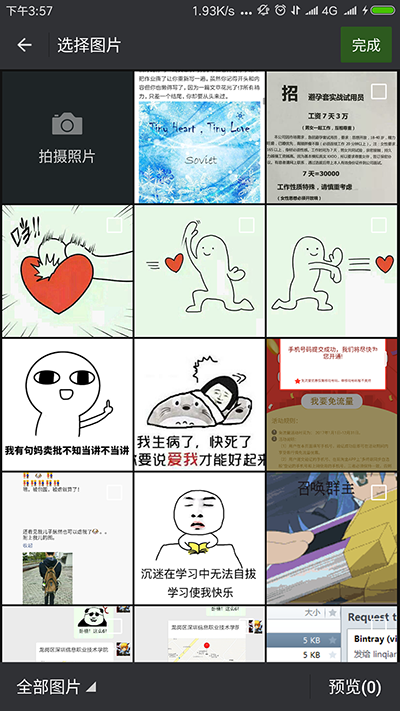
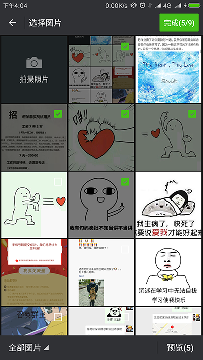
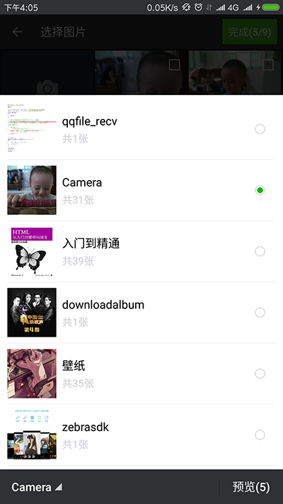

# LQRImagePicker
完全仿微信的图片选择，并且提供了多种图片加载接口，选择图片后可以旋转，可以裁剪成矩形或圆形，可以配置各种其他的参数

##一、简述：

本项目是基于[ImagePicker](https://github.com/jeasonlzy/ImagePicker)完善及界面修改。
主要工作：

>1. 原项目中UI方面与微信有明显差别，如：文件夹选择菜单的样式就不是很美观，高度比例与微信的明显不同，故对其进行美化；
>
>2. 原项目在功能方面有一个致命的BUG，在一开始打开菜单后，随便点击一张图片就会直接崩溃（亲测4.4可用，但6.0直接崩溃），本项目已对此进行了解决；
>
>3. 编码方面，原项目中获取本地文件uri路径时，使用Uri.fromFile()，这种方式不好，控制台会一直报错（such file or directory no found），故使用Uri.parse()进行代替。

##二、使用：

不得不说，原项目是一个非常不错的项目，有很多地方值得我们学习，其中图片的加载方案让我受益匪浅，通过定义一个接口，由第三方开发者自己在自己项目中实现，避免了在库中强制使用指定图片加载工具的问题，使得本项目的扩展性增强。当然也有其他值得学习的地方，在 [ImagePicker](https://github.com/jeasonlzy/ImagePicker)中有详细的配置方式，如有更多需求请前往原项目查看学习。这里我只记录下我自己项目中的使用配置：

###1、在自己项目中添加本项目依赖：

	compile 'com.lqr.imagepicker:library:1.0.0'

###2、实现ImageLoader接口(注意不是com.nostra13.universalimageloader.core.ImageLoader)，实现图片加载策略：

	/**
	 * @创建者 CSDN_LQR
	 * @描述 仿微信图片选择控件需要用到的图片加载类
	 */
	public class UILImageLoader implements com.lqr.imagepicker.loader.ImageLoader {
	    
		@Override
	    public void displayImage(Activity activity, String path, ImageView imageView, int width, int height) {
	        ImageSize size = new ImageSize(width, height);
	        com.nostra13.universalimageloader.core.ImageLoader.getInstance().displayImage(Uri.parse("file://" + path).toString(), imageView, size);
	    }
	
	    @Override
	    public void clearMemoryCache() {
	    }
	}

###3、在自定义Application中初始化(别忘了在AndroidManifest.xml中使用该自定义Application)：
	
	/**
	 * @创建者 CSDN_LQR
	 * @描述 自定义Application类
	 */
	public class App extends Application {
	
	    @Override
	    public void onCreate() {
	        super.onCreate();
	        initUniversalImageLoader();
	        initImagePicker();
	    }
	
	    private void initUniversalImageLoader() {
	        //初始化ImageLoader
	        ImageLoader.getInstance().init(
	                ImageLoaderConfiguration.createDefault(getApplicationContext()));
	    }
	
	    /**
	     * 初始化仿微信控件ImagePicker
	     */
	    private void initImagePicker() {
	        ImagePicker imagePicker = ImagePicker.getInstance();
	        imagePicker.setImageLoader(new UILImageLoader());   //设置图片加载器
	        imagePicker.setShowCamera(true);  //显示拍照按钮
	        imagePicker.setCrop(true);        //允许裁剪（单选才有效）
	        imagePicker.setSaveRectangle(true); //是否按矩形区域保存
	        imagePicker.setSelectLimit(9);    //选中数量限制
	        imagePicker.setStyle(CropImageView.Style.RECTANGLE);  //裁剪框的形状
	        imagePicker.setFocusWidth(800);   //裁剪框的宽度。单位像素（圆形自动取宽高最小值）
	        imagePicker.setFocusHeight(800);  //裁剪框的高度。单位像素（圆形自动取宽高最小值）
	        imagePicker.setOutPutX(1000);//保存文件的宽度。单位像素
	        imagePicker.setOutPutY(1000);//保存文件的高度。单位像素
	    }
	}

###4、打开图片选择界面代码：

	public static final int IMAGE_PICKER = 100;

    Intent intent = new Intent(this, ImageGridActivity.class);
    startActivityForResult(intent, IMAGE_PICKER);

###5、获取所选图片信息：

	@Override
    public void onActivityResult(int requestCode, int resultCode, Intent data) {
        super.onActivityResult(requestCode, resultCode, data);
        if (resultCode == ImagePicker.RESULT_CODE_ITEMS) {//返回多张照片
            if (data != null) {
                //是否发送原图
                boolean isOrig = data.getBooleanExtra(ImagePreviewActivity.ISORIGIN, false);
                ArrayList<ImageItem> images = (ArrayList<ImageItem>) data.getSerializableExtra(ImagePicker.EXTRA_RESULT_ITEMS);

                Log.e("CSDN_LQR", isOrig ? "发原图" : "不发原图");//若不发原图的话，需要在自己在项目中做好压缩图片算法
                for (ImageItem imageItem : images) {
                    Log.e("CSDN_LQR", imageItem.path);
                }
            }
        }
    }

##三、效果：

